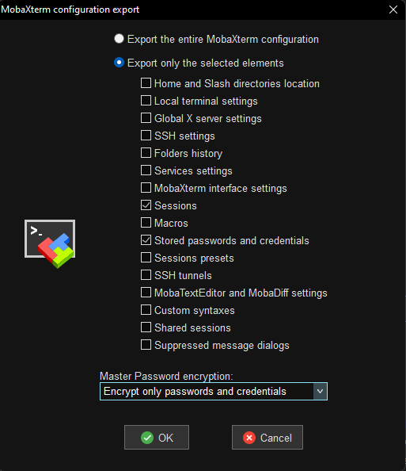

# mobaxterm_to_remmina

Migrating to GNU/Linux from MS Windows and afraid of losing your precious MobaXterm sessions?
Here is a handy tool to convert your sessions to Remmina profiles with their passwords included (optionally)

## Usage

Firstly, export the sessions from MobaXterm on MS Windows:



Open up a Terminal or cmd and execute the commands below.

Convert to Remmina profiles without stored passwords:

```powershell
python.exe mobaxterm2remmina.py ".\MobaXterm configuration (2022-06-05 04.15.06).mobaconf"  # replace the filename of course
```

Convert to profiles with stored passwords (you will be asked for MobaXterm master password and Remmina's secret which is located in ~/.config/remmina/remmina.pref "secret field"):

```powershell
python.exe .\mobaxterm2remmina.py ".\MobaXterm configuration (2022-06-05 04.15.06).mobaconf" --with-passwords  # replace the filename of course
```

The profiles will be exported to `./exported` locally, so you have to copy all these exported remmina files to your Linux host in `~/local/share/remmina` directory.

> NOTE: Stored passwords (DES3 encrypted and base64 encoded) will be removed from the .remmina files upon Remmina initialization and will be transfered to host's integrated keyring.

**The tool will preserve the group hierarchy of MobaXterm on Remmina**, so your sessions will be organized as they were.

## Installation

Clone/download the repo and install the requirements.

```bash
pip install -r ./requirements.txt
```

## Compatibility

This tool is currently compatible with SSH and RDP only.

VNC compatibility isn't implemented yet.
SSH jump hosts or gateways cannot be exported to Remmina as well as the private keys for the authentication.

## LICENSE

`mobaxterm_to_remmina` is available under the MIT license. See the LICENSE file for more info.
